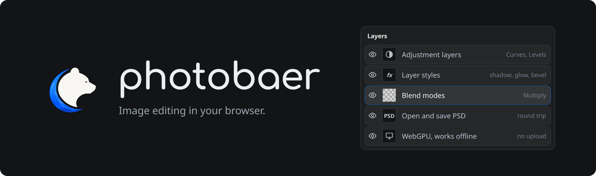
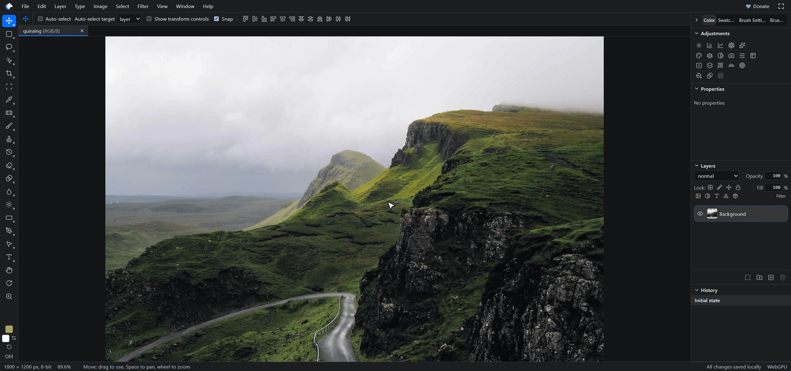
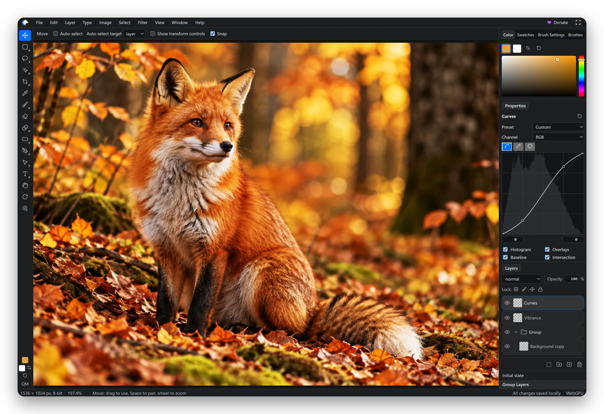
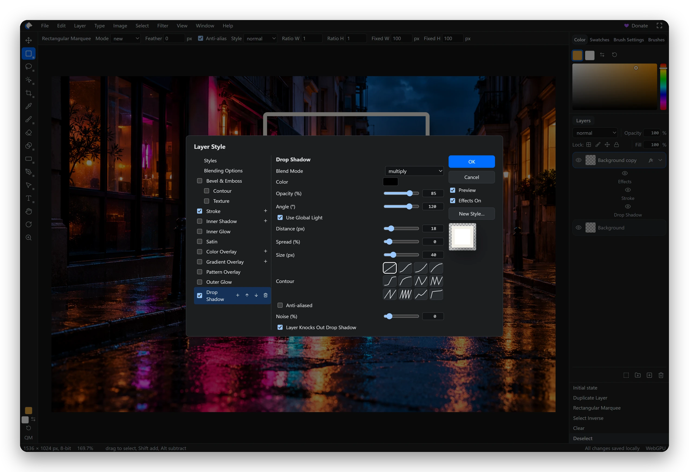
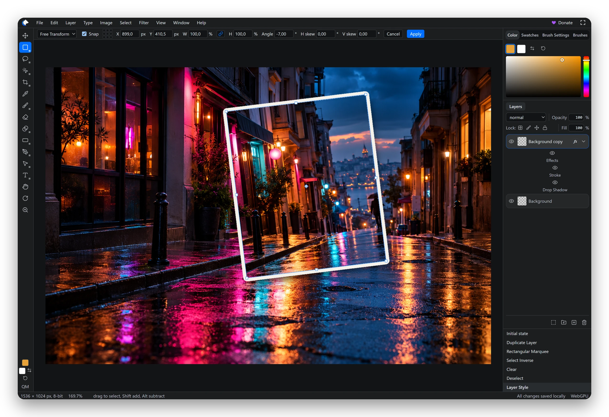
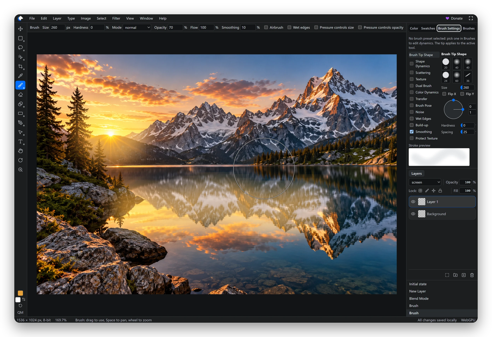
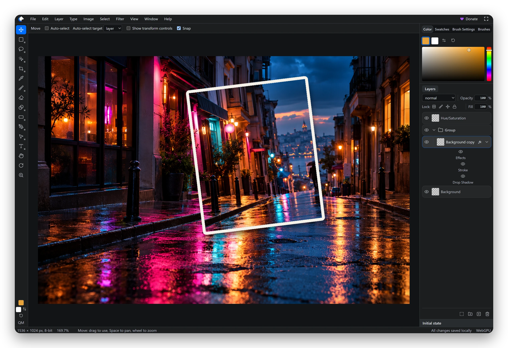

# photobaer

<p align="center"></p>

<p align="center">
  <a href="https://photobaer.com"></a>
  <a href="https://github.com/IT-BAER/photobaer/releases"></a>
  <a href="LICENSE"></a>
</p>

A free, open-source online photo editor and Photoshop alternative. Open [photobaer.com](https://photobaer.com) and start editing: no account, no upload, no install. It works offline, keeps your files on your device and opens and saves PSD files.

- ⌨️ **Photoshop habits work.** Same menus, shortcuts, tools and panel names. Ctrl+J duplicates a layer, Ctrl+M opens Curves.
- 🔒 **Your files stay local.** Nothing is uploaded. Works offline, installs as an app and autosaves open documents in the browser.
- 🗂️ **Layered PSD.** Opens and saves PSD with groups, masks, adjustment layers, layer styles and smart objects.
- 🌍 **12 languages.** Menus and tools use Photoshop's own names in each language, from German to Japanese.

<p align="center"></p>

## What you can do

<table>
  <tr>
    <td width="50%" valign="top">
      
      <br><sub>Groups with Vibrance and Curves adjustment layers.</sub>
      <h3>Layers</h3>
      Groups, blend modes, opacity and fill, clipping masks, layer and vector masks. Adjustment layers such as Levels, Curves, Hue/Saturation and Vibrance, fill layers, smart objects with smart filters, and layer comps.
    </td>
    <td width="50%" valign="top">
      
      <br><sub>Stroke and Drop Shadow in the Layer Style dialog.</sub>
      <h3>Layer styles</h3>
      Shadows, glows, bevel and emboss, satin, color, gradient and pattern overlays, and stroke. Blending options with Blend If and knockout, global light and saved styles.
    </td>
  </tr>
  <tr>
    <td width="50%" valign="top">
      
      <br><sub>Free Transform with numeric input on a styled layer.</sub>
      <h3>Transform</h3>
      Free Transform, warp with presets, crop and perspective crop, trim and canvas rotation. The Move tool snaps to guides, the grid and smart guides; artboards are supported.
    </td>
    <td width="50%" valign="top">
      
      <br><sub>The Brush tool and the Brush Settings panel.</sub>
      <h3>Painting and retouching</h3>
      Brushes with pen pressure and tilt, Brush Settings, ABR import and presets, gradients and the paint bucket. Clone stamp, healing and spot healing, patch, content-aware fill and move, dodge, burn, sponge, smudge and the history brushes.
    </td>
  </tr>
  <tr>
    <td width="50%" valign="top">
      
      <br><sub>A saved PSD opened again, with its group, effects and adjustment layer.</sub>
      <h3>Files</h3>
      Opens PNG, JPEG, WebP, GIF, BMP, AVIF and PSD. Saves PSD and exports PNG, JPEG and WebP. Open documents are saved in the browser automatically.
    </td>
    <td width="50%" valign="top">
      <h3>Selections</h3>
      Marquees, lassos including the magnetic lasso, magic wand, quick selection, color range and quick mask. Selections can be modified, saved and loaded.
      <h3>Type and vectors</h3>
      Point, paragraph, on-path and vertical text with OpenType features. Shapes, the pen tools and the Paths panel.
      <h3>Filters</h3>
      Blur, sharpen, noise and distort filters, plus Shadows/Highlights, HDR Toning, Match Color and Replace Color.
    </td>
  </tr>
</table>

The complete list is on [photobaer.com/features](https://photobaer.com/features/).

## AI agents and scripts

photobaer-mcp connects Claude Code, Codex or another MCP client to a photobaer tab in your browser. The agent opens, edits and saves files on your disk while you watch the document change; every step lands in History. Images travel over 127.0.0.1 only.

```sh
claude mcp add photobaer -- npx -y photobaer-mcp
```

For automation without an agent, File > Scripts > Browse… runs a JavaScript file against the open documents ([docs/scripting.md](docs/scripting.md)).

## How it works

The image engine is written in Rust (`engine/`) and compiled to WebAssembly. It runs in a web worker, so heavy filters do not block the interface. The React UI (`app/`) displays the canvas with WebGPU, or WebGL2 where WebGPU is missing. PSD files are read and written with [ag-psd](https://github.com/Agamnentzar/ag-psd) plus own code for bit depths and channels. A service worker makes the app work offline, and autosave uses the browser's private file system (OPFS). Everything is implemented from the public Photoshop documentation and PSD specification; no Adobe code or assets are used.

## Building and self-hosting

You need Rust (stable) with the `wasm32-unknown-unknown` target, `wasm-bindgen-cli` 0.2.129 (the version in `engine/Cargo.lock`), Node.js 24 and pnpm 10.

```sh
rustup target add wasm32-unknown-unknown
cargo install wasm-bindgen-cli --version 0.2.129
pnpm install
pnpm build:engine
pnpm dev
```

`pnpm test` runs the Rust and node tests; `pnpm build` writes the production site to `dist/`. Each [release](https://github.com/IT-BAER/photobaer/releases) also ships that site as a zip. To host it yourself, the web server must send `Cross-Origin-Opener-Policy: same-origin` and `Cross-Origin-Embedder-Policy: require-corp`, because the engine uses WebAssembly threads.

Repository layout, rules and checks for contributors and AI agents are in [AGENTS.md](AGENTS.md).

## Project status

photobaer is not at 1.0 yet. Many Photoshop features exist, but not all of them match Photoshop's behaviour yet, and the translations are drafts that wait for native speakers. See the [CHANGELOG](CHANGELOG.md) for what changed per version. Found a problem? Open an [issue](https://github.com/IT-BAER/photobaer/issues) and include your browser, the document size and a screenshot.

## License

photobaer is open source under the [GNU Affero General Public License v3.0](LICENSE) (AGPL-3.0-only). If you run a modified version for users over a network, the AGPL requires you to offer them its complete source code. photobaer-mcp in [`mcp/`](mcp/) is MIT licensed.

Commercial licenses without the AGPL obligations are available from IT-BAER: admin@it-baer.net.

"photobaer" and the photobaer logo are not covered by the code license. Forks must use a different name and logo. Photoshop is a trademark of Adobe; photobaer is not affiliated with Adobe.

## Contributing

Every contribution needs the [Contributor License Agreement](CLA.md), so that photobaer can stay available under both the AGPL and commercial licenses. See [CONTRIBUTING.md](CONTRIBUTING.md). Report security problems privately as described in [SECURITY.md](SECURITY.md).
